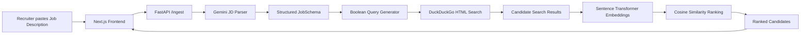

# RecruitAI Intelligence System

An AI-assisted recruiter sourcing application that turns an unstructured job description into structured requirements, generates candidate-search queries, collects web-search results, and ranks the returned profiles using semantic similarity.

The project is split into a **Next.js frontend** and a **FastAPI backend**.

## What the project does

RecruitAI follows this pipeline:



## Main features

- Job-description parsing with **Google Gemini** using Instructor + Pydantic structured output.
- Automatic extraction of role, required skills, minimum experience, location, remote status, and optional target companies.
- Boolean search query generation for:
  - LinkedIn profile discovery
  - GitHub user search
  - Generic resume/web search
- Web result collection through the DuckDuckGo HTML endpoint.
- Candidate ranking with the `all-MiniLM-L6-v2` Sentence Transformers model and cosine similarity.
- Next.js dashboard for entering a job description and viewing parsed requirements and ranked candidates.
- JSON pipeline output written locally to `output_jd.json` by the backend.

## Project structure

```text
recruiter-ai/
│
├── README.md                     # Project-wide documentation
│
├── backend/
│   ├── README.md                 # Backend-specific documentation
│   └── app/
│       ├── main.py               # FastAPI application and /ingest pipeline
│       ├── models.py             # Pydantic job/candidate schemas
│       └── services/
│           ├── parser.py         # Gemini + Instructor JD parser
│           ├── query_gen.py      # Boolean search query generator
│           ├── scraper.py        # DuckDuckGo HTML result scraper
│           └── ranker.py         # Sentence Transformer ranking
│
└── frontend/
    ├── README.md                 # Frontend documentation
    ├── package.json
    ├── next.config.ts
    ├── tsconfig.json
    └── src/
        └── app/
            ├── page.tsx          # RecruitAI dashboard
            ├── layout.tsx
            └── globals.css
```

## Tech stack

### Frontend

- Next.js 16
- React 19
- TypeScript
- Tailwind CSS 4
- Lucide React

### Backend

- Python
- FastAPI
- Pydantic
- Google Gemini
- Instructor
- Sentence Transformers
- PyTorch (used by Sentence Transformers)
- httpx
- BeautifulSoup

## Requirements

Install the following before running the project:

- Python 3.10+ recommended
- Node.js 20+ recommended
- A Google Gemini API key
- Internet access for Gemini and web-search requests

## Backend setup

Open a terminal in the repository root:

```bash
cd backend
python -m venv venv
```

### Windows PowerShell

```powershell
.\venv\Scripts\Activate.ps1
```

If PowerShell blocks script activation, you can run the backend with the virtual-environment Python executable directly or adjust your local execution policy.

Install dependencies:

```bash
pip install fastapi uvicorn pydantic python-multipart instructor google-generativeai sentence-transformers torch httpx beautifulsoup4
```

### Configure Gemini

The current implementation configures Gemini in `backend/app/services/parser.py`. Replace the placeholder with your API key before running the backend.

For production use, move the key to an environment variable instead of storing it in source code.

Start the API:

```bash
python -m app.main
```

The backend will be available at:

```text
http://localhost:8000
```

API documentation:

```text
http://localhost:8000/docs
```

## Frontend setup

Open a second terminal in the repository root:

```bash
cd frontend
npm install
npm run dev
```

Open:

```text
http://localhost:3000
```

The current frontend sends the job description to:

```text
POST http://localhost:8000/ingest
```

## API

### `GET /`

Health/info endpoint.

Example response:

```json
{
  "message": "RecruitAI Backend is running. Access API docs at /docs"
}
```

### `POST /ingest`

Accepts the job description as multipart form data:

```text
raw_text=<job description>
```

The endpoint then:

1. Parses the job description into `JobSchema`.
2. Generates platform-specific search queries.
3. Searches the web for candidate results.
4. Calculates semantic similarity scores.
5. Returns the ranked candidates.

Example high-level response:

```json
{
  "status": "success",
  "parsed_jd": {},
  "generated_queries": {},
  "ranked_candidates": []
}
```

## Important implementation notes

This repository currently represents a working development/MVP pipeline rather than a production deployment.

- The frontend currently uses `http://localhost:8000/ingest` directly.
- CORS in the backend is currently configured for `http://localhost:3000`.
- The Gemini API key is currently referenced in source code and should be moved to environment-based configuration.
- Candidate discovery depends on HTML search results and should be reviewed for reliability, rate limits, robots/terms compliance, and production suitability before deployment.
- `output_jd.json` is written to the backend's current working directory after an ingestion request.
- The candidate ranking score is a semantic-similarity score, not a verified hiring recommendation.
- The `JobSchema` currently limits extracted required skills to the top five, while query generation uses the first four skills for LinkedIn/resume searches and the first three for GitHub queries.

## Development roadmap

Potential next steps include:

- Environment-variable based configuration and secrets management.
- Database-backed job and candidate history.
- Authentication and recruiter accounts.
- Background jobs for scraping and ranking.
- More robust and compliant candidate-data acquisition.
- Better candidate-profile parsing instead of relying mainly on search-result title/snippet text.
- Configurable ranking weights and recruiter-defined filters.
- Persistent search history and audit logs.
- Deployment configuration for frontend and backend environments.

## License

No project license is currently specified in the repository. Add a `LICENSE` file when a license is selected.
