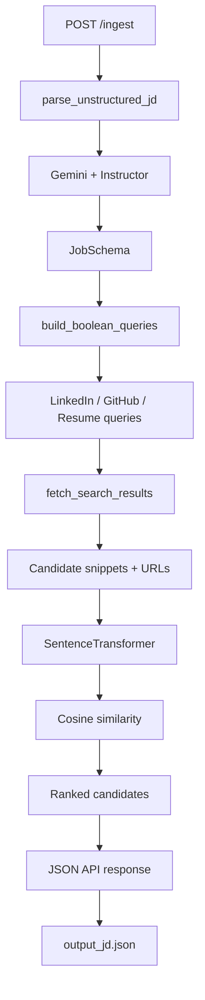

# RecruitAI Backend

FastAPI backend for the RecruitAI Intelligence System. It accepts a raw job description, converts it into structured recruiter requirements with Google Gemini, generates search queries, collects web-search results, and ranks candidates using semantic similarity.

## Backend architecture



## Folder structure

```text
backend/
│
├── README.md
└── app/
    ├── main.py
    ├── models.py
    └── services/
        ├── parser.py
        ├── query_gen.py
        ├── scraper.py
        └── ranker.py
```

## Components

### `app/main.py`

Creates the FastAPI application and exposes the two current endpoints:

- `GET /`
- `POST /ingest`

The `/ingest` endpoint orchestrates the complete pipeline:

```text
Raw JD
  ↓
Gemini parsing
  ↓
Structured JobSchema
  ↓
Boolean query generation
  ↓
Web search
  ↓
Candidate result collection
  ↓
Semantic ranking
  ↓
JSON response
```

### `app/models.py`

Defines Pydantic models:

#### `JobSchema`

Contains:

- `title`
- `required_skills`
- `min_years_experience`
- `location`
- `is_remote`
- `target_companies` (optional)

#### `CandidateProfile`

Defines the intended candidate profile structure with name, role, experience, location, skills, profile URL, and relevance explanation.

### `app/services/parser.py`

Uses Google Gemini through `google-generativeai` and Instructor to request structured output matching `JobSchema`.

The parser is given two instructions:

1. Act as a professional technical recruiter.
2. Extract structured requirements from the supplied job description.

### `app/services/query_gen.py`

Generates three query formats from the parsed job:

- `linkedin_dork` — Google-style `site:linkedin.com/in/` search query.
- `github_search` — GitHub user query with topic filters.
- `generic_resume_search` — generic resume/web search query.

Remote jobs omit the location constraint from the LinkedIn/GitHub query logic when appropriate.

### `app/services/scraper.py`

Uses `httpx` and `BeautifulSoup` to request DuckDuckGo's HTML search page and extract:

- result URL
- result title
- result snippet
- source label

The current implementation returns up to five results by default.

### `app/services/ranker.py`

Uses the Sentence Transformers model:

```text
all-MiniLM-L6-v2
```

The ranking process is:

1. Build a compact text representation of the job requirements.
2. Build text blocks from each candidate's title and snippet.
3. Encode the job and candidate text into embeddings.
4. Calculate cosine similarity.
5. Convert the similarity value to a readable percentage-like score.
6. Sort candidates from highest score to lowest score.

## Installation

From the repository root:

```bash
cd backend
python -m venv venv
```

Activate the environment.

Windows PowerShell:

```powershell
.\venv\Scripts\Activate.ps1
```

Install the current runtime dependencies:

```bash
pip install fastapi uvicorn pydantic python-multipart instructor google-generativeai sentence-transformers torch httpx beautifulsoup4
```

## Gemini API key

The current `parser.py` contains a placeholder where the Gemini API key is configured.

Replace the placeholder for local testing, but do **not** commit a real API key to GitHub.

For a production-ready backend, load the key from an environment variable or a secrets manager.

## Run the backend

Run from inside the `backend` directory:

```bash
python -m app.main
```

Or:

```bash
uvicorn app.main:app --reload --host 0.0.0.0 --port 8000
```

API base URL:

```text
http://localhost:8000
```

Swagger UI:

```text
http://localhost:8000/docs
```

## API usage

### `GET /`

Returns a simple backend status message.

### `POST /ingest`

Send the job description as multipart form data:

```text
raw_text=<job description>
```

Example with `curl`:

```bash
curl -X POST "http://localhost:8000/ingest" \
  -F "raw_text=Senior Python Developer with 3+ years of FastAPI and PostgreSQL experience in Bengaluru"
```

The response contains:

```json
{
  "status": "success",
  "parsed_jd": {
    "title": "...",
    "required_skills": [],
    "min_years_experience": 0,
    "location": "...",
    "is_remote": false,
    "target_companies": null
  },
  "generated_queries": {
    "linkedin_dork": "...",
    "github_search": "...",
    "generic_resume_search": "..."
  },
  "ranked_candidates": []
}
```

## Current limitations

- No database is currently used by the backend.
- No authentication or authorization is implemented.
- No persistent job/candidate storage is implemented.
- Web search relies on an HTML page structure and may break if that structure changes.
- Search results provide snippets and URLs rather than fully verified candidate profiles.
- Ranking uses semantic similarity and should not be treated as a final recruitment decision.
- There is no background task queue in the current implementation.
- No production logging/monitoring stack is configured.

## Security notes

Before deploying:

- Move the Gemini key out of source code.
- Configure CORS from environment-specific settings.
- Add request validation and rate limiting.
- Add structured logging and monitoring.
- Review third-party search and profile-data usage against applicable terms and policies.
- Avoid storing unnecessary personal candidate information.

## License

No license is currently specified for this backend.
